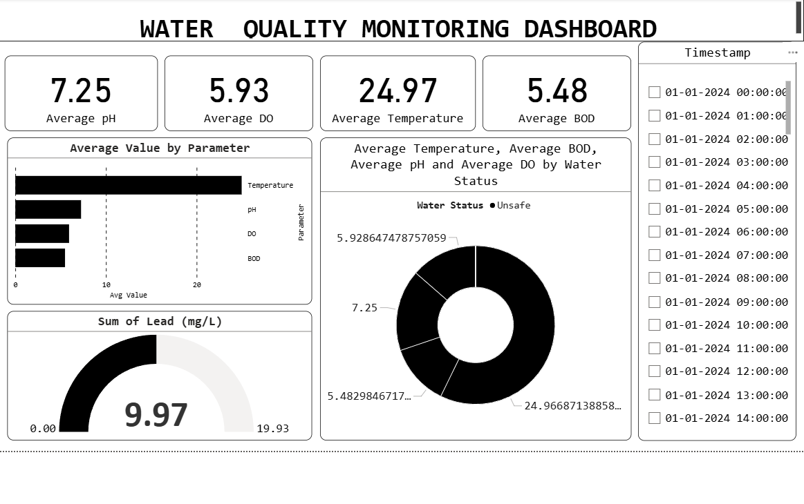

# 💧 Water Quality Analysis — Power BI Dashboard

> **An interactive Power BI report analyzing water quality parameters across multiple sources to classify pollution risk levels and track environmental trends over time.**

---

## 📌 Project Overview

Access to clean water is a critical public health concern. This project analyzes key water quality parameters — pH, Dissolved Oxygen, BOD, Temperature, and Lead concentration — across multiple water sources to identify high-risk zones and track pollution trends over time.

The dashboard enables environmental analysts and public health teams to monitor water safety without manual data extraction, using interactive filters to isolate problem sources instantly.

---

## ✨ Dashboard Features

- 📊 KPI cards for Average pH, Average BOD, Average DO, and Average Temperature
- 🗺️ Water source breakdown with Risk Level classification
- 📈 Time-intelligence visuals across Year, Quarter, Month, and Day
- ⚠️ Lead concentration (mg/L) and Pollution Level tracking
- 🔍 Cross-filtering by Water Source and Risk Level
- 🎨 Clean multi-page layout with branded theme

---

## 📂 Dataset

**Dataset:** Water Quality Dataset

### Parameters Analyzed

| Parameter | Unit | Description |
|---|---|---|
| pH | Scale 0–14 | Acidity/alkalinity of water |
| Dissolved Oxygen (DO) | mg/L | Oxygen available for aquatic life |
| Biological Oxygen Demand (BOD) | mg/L | Organic pollution indicator |
| Temperature | °C | Water temperature |
| Lead | mg/L | Heavy metal contamination |
| Pollution Level | Index | Overall pollution classification |
| Risk Level | Category | Safety classification per source |

---

## 🛠️ Tools Used

| Tool | Purpose |
|---|---|
| Power BI Desktop | Report building & visualization |
| DAX | Calculated measures & KPIs |
| Power Query | Data transformation & cleaning |

---

## 📊 Dashboard Pages

### Page 1 — Overview
- KPI summary cards (Avg pH, Avg BOD, Avg DO, Avg Temperature)
- Parameter trend analysis over time (Year → Quarter → Month → Day)
- Water Source vs Risk Level distribution
- Lead concentration monitoring

---

## 📈 Key Insights

✅ Water sources with high BOD readings consistently show elevated Risk Levels, indicating organic pollution.

✅ Lead concentration (mg/L) varies significantly across sources — certain sources exceed safe thresholds.

✅ Dissolved Oxygen levels show seasonal patterns, dropping in warmer months.

✅ pH levels across most sources fall within the 6.5–8.5 safe range, with outlier sources flagged.

---

## 🖼️ Dashboard Preview

---

## 🚀 How to View

1. Download `waterqualityproject.pbix`
2. Open with [Power BI Desktop](https://powerbi.microsoft.com/desktop/) (free)
3. Interact with slicers to filter by Water Source, Risk Level, and Time Period

---

## 💡 Skills Demonstrated

- Data cleaning & transformation (Power Query)
- DAX measures & calculated KPIs
- Time-intelligence analysis
- Multi-parameter environmental data analysis
- Interactive dashboard design
- Risk classification & threshold analysis

---

## 👨‍💻 About Me

**Deepak Baditya** — Aspiring Data Analyst

- 💼 LinkedIn: [linkedin.com/in/deepakbaditya](https://linkedin.com/in/deepakbaditya)
- 💻 GitHub: [github.com/DeepakBaditya](https://github.com/DeepakBaditya)
- 🔗 Portfolio Project: [Customer Churn Prediction](https://github.com/DeepakBaditya/Customer-Churn-Prediction)
